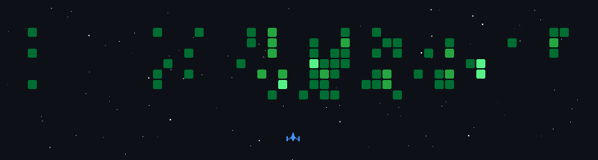

<h1 align="center">Hi 👋, I'm Fadli Ramadhan</h1>
 
🔭 I'm currently active as web developer.  
🌱 Most programming languange im using is javascript.  
🔧 I'm very interested in making something especially in website.  
📫 How to reach me: fadli16ramadhan@gmail.com

## :mailbox_with_no_mail: Socials 

## :computer: Tech Stack
     

